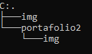

# :page_facing_up: Portafolio personal

Este es mi portafolio personal, en donde presento una muestra de quien soy, mis habilidades, conocimientos y algunos de mis proyectos mas destacados

## :card_file_box: Caracteristicas
- Pagina de inicio: En esta página te cuento un poco sobre mí y te muestro las habilidades que estoy desarrollando como programador
- Sobre mi: busco reflejar mi compromiso profesional y proyección en el campo del desarrollo Web Full Stack, describiendo los lenguajes y tecnologías que manejo, así como mi disposición constante a aprender y adaptarme a nuevos desafíos
- Proyectos: Presento los proyectos más destacados en los que he trabajado para dar visibilidad a mi experiencia y habilidades
- Habilidades: presento las tecnologías y lenguajes de programación que domino y utilizo en mis proyectos. Estos logos representan las herramientas con las que he trabajado

## :wrench: Tegnologias Utilizadas
- HTML5
- CSS

## Estructura

## Visita mi portafolio
- [https://jeanfrancoguerreroacero.github.io/portafolio2/](https://jeanfrancoguerreroacero.github.io/portafolio2/)

## Desarrollado por
- Jean Franco Guerrero Acero
